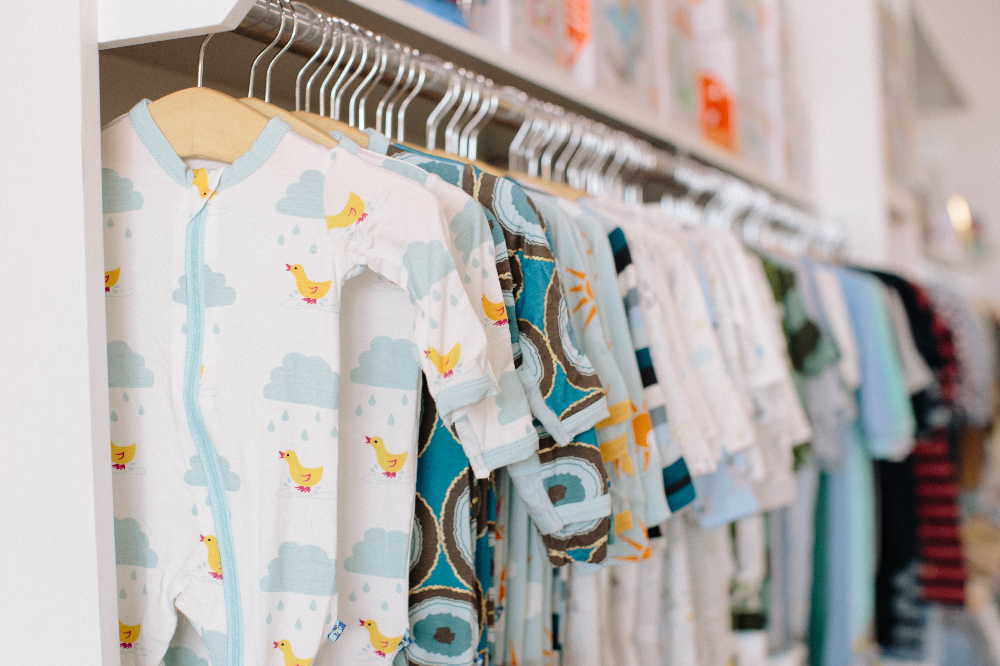
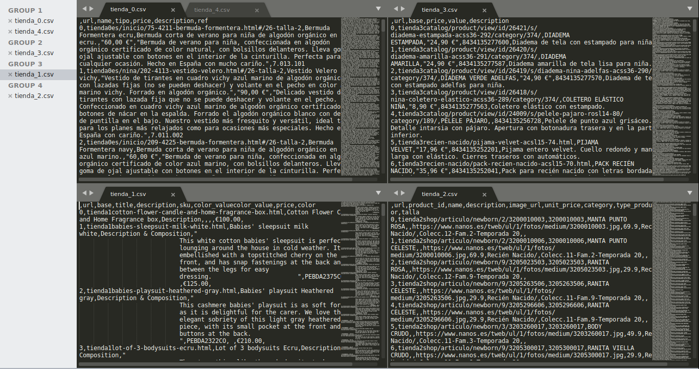

# Las tiendas de ropa infantil on line.

Photo by <a href="https://unsplash.com/@jordannix?utm_source=unsplash&utm_medium=referral&utm_content=creditCopyText">Jordan Nix</a> on <a href="/s/photos/baby-clothes?utm_source=unsplash&utm_medium=referral&utm_content=creditCopyText">Unsplash</a>
  

## Contexto
El objeto de este proyecto es el de obtener de 5 tiendas on line de ropa infantil detalle de todos los productos que venden.
Al final del proyecto obtendremos 5 ficheros csv donde se muestran los productos que cada retail tiene en ese momento.

## Las tiendas

  

  

  

  

  

## Los dataset

Se encuentran almacenados en la carpeta data.

## Robots.txt

Previa a la realización del trabajo, he generado un script para el análisis del fichero Robots.txt al objeto de conocer 
las páginas y fichero podemos solicitar y cuales no.

Para ejecutar el script:

    $ python robots.py

El resultado del análisis de los 5 retails se puede consultar en el fichero **[robots.md](robots.md)**

## Operativa:  
Basicamente los 5 datasets obtenidos tienen como estructura comun los siguientes campos:  

* Url
* Nombre producto
* Preferencia
* Descipción
* Precio

La forma de recopiar los datasets son muy parecidas y en el siguiente orden:  
1. Obtendo la url raiz de la tienda (contendida en un archivo plano)
2. Subtituyo la url por la palabra tienda  
3. Recorro la raiz inicial en busca de url "hijos"  
4. Recopilo los diferentes URL en una lista que la limpio de datos innecesarios y elementos duplicados  
5. Recorro la lista de hijos en busca de nuevas url
6. Recopilo las nuevas url y hago nuevamente una limpieza de la nueva lista.
7. De esta última lista de url donde se detallan cada uno de los productos, realizo el scraping
8. Genero un diccionario seleccionando los campos que más me interesan.
9. Por último convierto el diccionario en un dataframe y este en un csv.

En todas las transformaciones y con el fin de preservar la url y el nombre comercial de la empresa retail,
aplico el pundo 2

## Propietarios de los datos

https://twinandchic.com/  
https://www.bonpoint.com/es/  
https://www.nanos.es/  
https://www.bonnetapompon.com/es/es/  
https://www.ilgufo.com/eu_en/  

## Inspiración. 

El presente proyecto está basado en una conversación con una persona que me indicó que una vez cada mes debia de visitar
las páginas webs de estas tiendas y contar el número de nuevos productos y familias que se vendian con cada nueva temporada.

## Licencia

He elegigido CC BY-NC-SA 4.0 ya que:
Esta [licencia](LICENSE.md) no permite un uso comercial de la obra original ni de las posibles obras derivadas. Además, la distribución 
de estas obras derivadas se debe hacer con una licencia igual a la que regula la obra original.

## Los dataset
10. Dataset. Publicación del dataset en formato CSV en Zenodo (obtención del DOI)
con una breve descripción.

## Operativa.

Para su correcta ejecución recomiendo:
1. Generar una carpeta

        $ mkdir -directorio
    
2. Generar un entorno virtual   
    en linux  
    
        $ python3 -m venv /path/to/new/virtual/environment   
    
    en windows
    
        c:\>c:\Python35\python -m venv c:\path\to\myenv
    
3. Instalar los módulos necesarios detallados en el fichero requirements.txt

        $ pip install requirements.txt
    
4. Ejecutar cada un de los ejecutables según la tienda

        $ python tienda_#.py
    
    donde # es el número de tienda, desde 0 hasta 1.
    
    
## El resultado final

